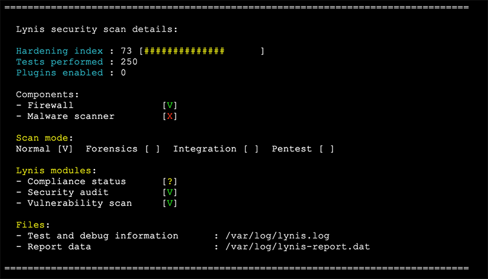

# Ansible Technical Challenge

## Overview

The Ansible playbook in this repository will provision two AWS EC2 instances, a Security Group, and an SSH key pair for administering the instances if needed.
Each EC2 instance will be hosting static content from the [One HTML Page Challenge](https://onehtmlpagechallenge.com/).
As part of the deployment, hardening steps will be executed, and a [Lynis](https://cisofy.com/lynis/) security scan and report generated against each instance upon deployment completion.

## Prerequisites

* Ansible - Follow the [Ansible Installation Guide](https://docs.ansible.com/ansible/latest/installation_guide/intro_installation.html) paying attention to OS based pre-requisites.
* AWS SDK for Python (boto3)
  > NOTE: `boto` is the legacy SDK, however, it is required for `amazon.aws.ec2`. The next release of the `amazon.aws` collection will include a new `ec2_instance` module, which will no longer rely on `boto`.

  ```bash
  pip install --user boto botocore boto3
  ```

## Local Setup

These steps were executed and verfified on a macOS and Linux system

## Objectives

In no particular order, the following will be deployed 
- Amazon EC2 T2 instances (minimum spec `t2.small`)
- Kubernetes (K3s)
- [Bitnami NGINX Helm chart](https://github.com/bitnami/charts/tree/master/bitnami/nginx)
- Let's Encrypt public certificates (ACME v2 Production)

## Usage

1. Export [named profile for the AWS CLI](https://docs.aws.amazon.com/cli/latest/userguide/cli-configure-profiles.html)

```bash
export AWS_PROFILE=your-aws-profile
```

2. Export Dynamic DNS API Keys (encrypted with Ansible Vault)

```bash
for vaultSecret in $(ansible-vault view api_keys.txt); 
  do export "${vaultSecret}";
done
```

3. Install Ansible requirements and run playbook

```bash
ansible-galaxy collection install -r collections/requirements.yml
ansible-playbook site.yml
```

## Website URLs

The Ansible playbook will download static content, and provision Let's Encrypt public certificates. The whole process should complete in 15 minutes, however please allow up to 30 minutes for DNS to be updated and Let's Encrypt certificates to be provisioned. When ready, the websites are avaialble at the following URLs:

- https://henrihare.mooo.com
- https://henrithe.mooo.com

## Lynis Security Scan

Lynis security scan and report for each instance is generated and stored in `output/`.  
e.g. to view the report (with ANSI colours), run `less -R output/lynis-ec2-X-X-X-X.txt`.  

Sample view:  


## SSH Access

1. If SSH access is required, ensure that the allowed IP address/addresses are whitelisted before running the Ansible playbook

```bash
group_vars/all.yml
```

2. Example syntax to SSH into an instance

```bash
ssh -i output/ansible-sandbox.pem ec2-user@x.x.x.x
```

## Cleaning up

> NOTE: The following syntax will delete the provisioned resources in AWS and the downloaded private key.

```bash
ansible-playbook ec2-destroy.yml
```

## Other Notes

* Ansible config settings are stored in `ansible.cfg`
* The EC2 inventory file is set to `aws_ec2.yml`
* Strict host key checking is disabled to omit `The authenticity of host ... can't be established.` warning
* This is a Proof of concept (POC) set up and not proven to be run in a production environment
